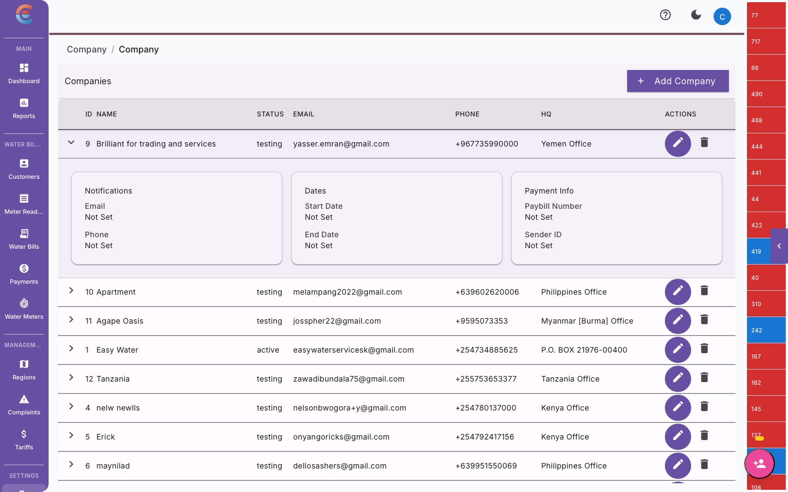

import { Steps, Tabs, TabItem } from '@astrojs/starlight/components';

Notifications keep your customers informed about their bills and payments, and alert your team about operational events like reading anomalies or overdue accounts. EasyBiller supports **SMS** (via Africa's Talking) and **email** notifications.

This guide covers how to set up notification channels, configure triggers, customize templates, and test delivery.


## Notification channels

### SMS via Africa's Talking

SMS is the most reliable way to reach customers in East Africa, where many users have basic phones without email access. EasyBiller integrates with [Africa's Talking](https://africastalking.com/) for SMS delivery.

#### Setting up Africa's Talking

If you have not yet connected your Africa's Talking account, follow these steps:



<Steps>
  1. **Create an Africa's Talking account** at [africastalking.com](https://africastalking.com/) if you do not already have one.

  2. **Get your API credentials.** In the Africa's Talking dashboard, go to **Settings > API Key**. Copy your **username** and **API key**.

  3. **Register a Sender ID** (optional but recommended). A Sender ID is the name that appears as the sender on your customers' phones (for example, "MajiWater" instead of a random short code). Apply for one in the Africa's Talking dashboard under **SMS > Sender IDs**. Approval typically takes 2 to 5 business days.

  4. **Enter credentials in EasyBiller.** Go to **Settings > Company Settings > Notifications > SMS** and enter:
     - **Username** — your Africa's Talking username
     - **API Key** — your Africa's Talking API key
     - **Sender ID** — your approved sender name, or leave blank to use the default short code

  5. **Click "Save".**
</Steps>

#### Testing SMS delivery

Before enabling SMS notifications for your customers, send a test message:

<Steps>
  1. Go to **Settings > Company Settings > Notifications > SMS**.
  2. Click **"Send Test SMS"**.
  3. Enter your own phone number.
  4. Click **"Send"**.
  5. You should receive the test message within a few seconds. If you do not, see [Troubleshooting](#troubleshooting) below.
</Steps>

:::tip[Test on sandbox first]
Africa's Talking provides a sandbox environment for testing without consuming your SMS balance. In the Africa's Talking dashboard, switch to "Sandbox" mode, generate sandbox credentials, and use those in EasyBiller temporarily. Switch back to production credentials when you are ready to go live.
:::

### Email notifications

Email notifications are handled by EasyBiller's infrastructure. You do not need to configure an SMTP server.


<Steps>
  1. Go to **Settings > Company Settings > Notifications > Email**.
  2. Set the **From name** (for example, "Maji Water Billing").
  3. Set the **Reply-to address** (for example, billing@majiwater.co.ke).
  4. Click **"Save"**.
</Steps>

Emails are sent from a `noreply@easybiller.com` address with your configured "From name" in the display field.

## Notification triggers

Each notification type is tied to a specific event. You can enable or disable each channel (SMS and email) independently.

### Customer-facing notifications

These are sent directly to your customers.

| Trigger | Description | SMS | Email |
|---|---|---|---|
| **Bill generated** | Sent when a new bill is created for a customer | Toggle | Toggle |
| **Payment received** | Confirmation after a payment is recorded (M-Pesa or manual) | Toggle | Toggle |
| **Payment overdue** | Reminder sent after the grace period expires without payment | Toggle | Toggle |
| **Disconnection warning** | Final notice before service disconnection due to non-payment | Toggle | Toggle |
| **Receipt issued** | Sent with a payment receipt after reconciliation | Off | Toggle |

### Team-facing notifications

These are sent to your internal team members based on their roles.

| Trigger | Recipient | Channel | Description |
|---|---|---|---|
| **Reading anomaly** | Admin, Manager | Email | A meter reading deviates significantly from the average |
| **Sync failure** | Admin | Email | A field reader's data has not synced for over 24 hours |
| **Bulk billing complete** | Admin, Accountant | Email | The automatic billing run has finished |
| **New payment received** | Accountant | Email | A payment has been recorded (useful for reconciliation workflows) |
| **Meter issue reported** | Admin, Manager | Email | A field reader reported a damaged, tampered, or inaccessible meter |

### Configuring triggers

<Steps>
  1. Go to **Settings > Company Settings > Notifications**.
  2. Each notification trigger is listed with toggle switches for **SMS** and **Email**.
  3. Toggle the channels you want active for each event.
  4. Click **"Save"** at the bottom of the section.
</Steps>

## Customizing notification templates

You can customize the content of SMS and email notifications to match your company's tone and include relevant details.

### SMS templates

SMS templates use **placeholders** that are replaced with actual values when the message is sent.

Available placeholders:

| Placeholder | Value | Example |
|---|---|---|
| `{customer_name}` | Customer's full name | Jane Wanjiku |
| `{account_number}` | Customer's account number | ACC-00452 |
| `{amount}` | Bill amount or payment amount | KES 1,250.00 |
| `{due_date}` | Bill due date | 15 Feb 2026 |
| `{period}` | Billing period | Jan 2026 |
| `{balance}` | Outstanding balance | KES 3,500.00 |
| `{company_name}` | Your company name | Maji Water |
| `{paybill}` | Your M-Pesa paybill number | 123456 |
| `{meter_number}` | Customer's meter serial number | M-2024-0871 |

**Example: Bill generated SMS template**

```
Dear {customer_name}, your water bill for {period} is KES {amount}.
Pay via M-Pesa Paybill {paybill}, Acc: {account_number}.
Due: {due_date}. {company_name}
```

<Steps>
  1. Go to **Settings > Company Settings > Notifications > Templates**.
  2. Select the notification type you want to customize (for example, "Bill Generated - SMS").
  3. Edit the template text. Insert placeholders by clicking them from the placeholder list or typing them directly.
  4. Check the **character count**. A single SMS is 160 characters. Messages longer than 160 characters are split into multiple SMS messages and cost more.
  5. Click **"Preview"** to see how the message looks with sample data.
  6. Click **"Save"**.
</Steps>

:::caution[SMS length and cost]
Keep SMS messages under 160 characters (one SMS segment) to control costs. Each additional segment doubles or triples the per-message cost. Use abbreviations where appropriate (for example, "Acc" instead of "Account").
:::

### Email templates

Email templates support richer formatting. The system provides a base layout with your company logo and a footer. You customize the body content.

<Steps>
  1. Go to **Settings > Company Settings > Notifications > Templates**.
  2. Select the notification type you want to customize (for example, "Bill Generated - Email").
  3. Edit the **subject line** and **body content**. The same placeholders available for SMS work in email templates.
  4. Click **"Preview"** to see a rendered version.
  5. Click **"Save"**.
</Steps>

Email templates support basic formatting: bold, italic, links, and line breaks. They do not support custom HTML for security and deliverability reasons.

## Overdue payment reminders

Overdue reminders deserve special attention because they directly affect your revenue collection.

### How overdue reminders work

<Steps>
  1. A bill is generated with a **due date**.
  2. The **grace period** (configured in [Company Settings](/account/company-settings/)) passes without full payment.
  3. The system marks the bill as **overdue**.
  4. If the "Payment overdue" notification is enabled, the customer receives an SMS and/or email reminder.
  5. If a **disconnection warning** trigger is enabled, a second, stronger notice is sent after a configurable number of days past due.
</Steps>

### Configuring reminder timing

<Steps>
  1. Go to **Settings > Company Settings > Billing**.
  2. Set the **grace period** (for example, 7 days after the due date).
  3. Set the **disconnection warning delay** (for example, 21 days after the due date).
  4. These dates determine when overdue and disconnection notifications are sent.
</Steps>

## Testing notifications

Always test your notification setup before enabling it for all customers.

### Testing SMS

<Steps>
  1. Go to **Settings > Company Settings > Notifications > SMS**.
  2. Click **"Send Test SMS"**.
  3. Enter a phone number (your own or a colleague's).
  4. Select the template to test (for example, "Bill Generated").
  5. Click **"Send"**. The system sends the message with sample data filled in for the placeholders.
  6. Verify the message arrives and reads correctly.
</Steps>

### Testing email

<Steps>
  1. Go to **Settings > Company Settings > Notifications > Email**.
  2. Click **"Send Test Email"**.
  3. Enter an email address.
  4. Select the template to test.
  5. Click **"Send"** and check your inbox.
</Steps>

:::tip[Test with real data]
After testing with sample data, generate a bill for a test customer with notifications enabled. This confirms the full pipeline works — from bill generation, through template rendering, to actual delivery.
:::

## Troubleshooting

### SMS not arriving

| Possible cause | Solution |
|---|---|
| **Wrong API credentials** | Re-enter your Africa's Talking username and API key. Copy them directly from the Africa's Talking dashboard. |
| **Sender ID not approved** | Remove the Sender ID and test with the default short code. If that works, your Sender ID application may still be pending. |
| **Africa's Talking balance is zero** | Log in to Africa's Talking and check your balance. Top up to continue sending. |
| **Phone number format** | Ensure phone numbers include the country code (for example, +254712345678 for Kenya). |
| **Network issues** | Some mobile networks delay or block bulk SMS. Try sending to a different number on a different network. |
| **Sandbox vs Production** | Make sure you are using production credentials, not sandbox. Sandbox messages only go to sandbox numbers. |

### Email not arriving

| Possible cause | Solution |
|---|---|
| **Spam folder** | Ask the recipient to check their spam or junk folder. |
| **Incorrect email address** | Verify the customer's email address in their profile. |
| **Domain blocking** | Some corporate email servers block unknown senders. Ask the recipient's IT team to whitelist `easybiller.com`. |

### Notifications enabled but not sending

- Verify the specific trigger is toggled **on** for the correct channel (SMS or email).
- Check that the customer has a valid phone number (for SMS) or email address (for email) in their profile.
- Review the **Notification Log** (Settings > Notifications > Log) to see if messages were attempted and what the delivery status was.

## Notification log

The notification log records every message the system attempts to send. Use it to diagnose delivery issues.

<Steps>
  1. Go to **Settings > Notifications > Log**.
  2. Filter by date range, notification type, channel (SMS or email), or delivery status (sent, failed, pending).
  3. Click any entry to see the full message content, recipient, timestamp, and error details (if applicable).
</Steps>

## Next steps

- **[Company Settings](/account/company-settings/)** — return to the main settings overview.
- **[Generating Bills](/water-billing/generating-bills/)** — learn how the billing cycle triggers customer notifications.
- **[Recording Payments](/water-billing/payments/)** — understand how payment confirmations are sent.
- **[Common Issues](/troubleshooting/common-issues/)** — broader troubleshooting for the platform.
