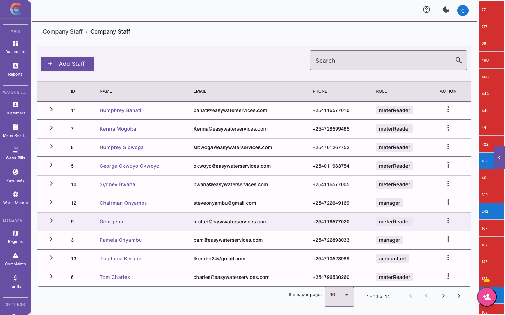
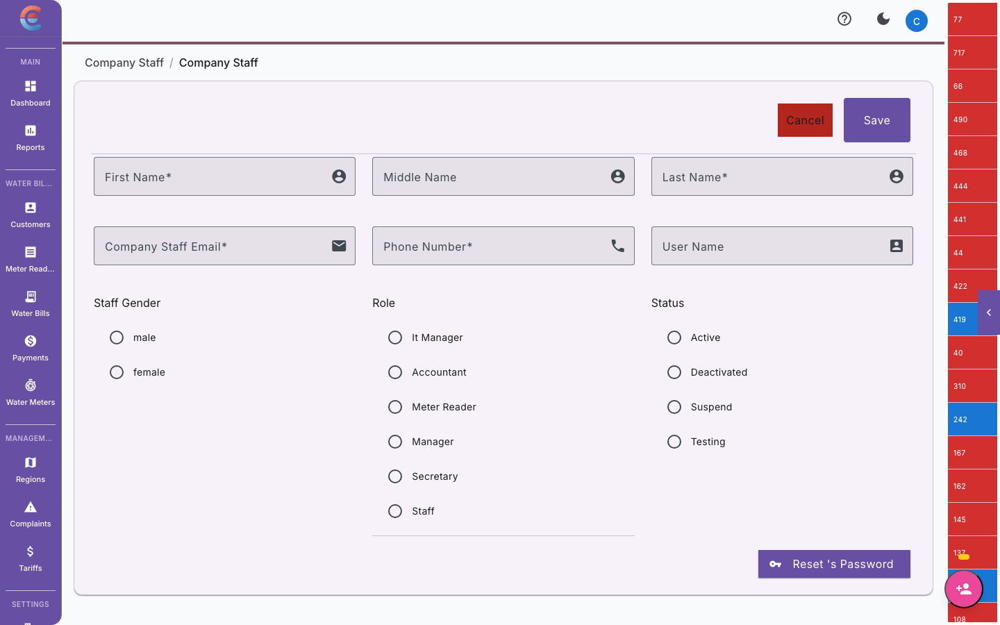
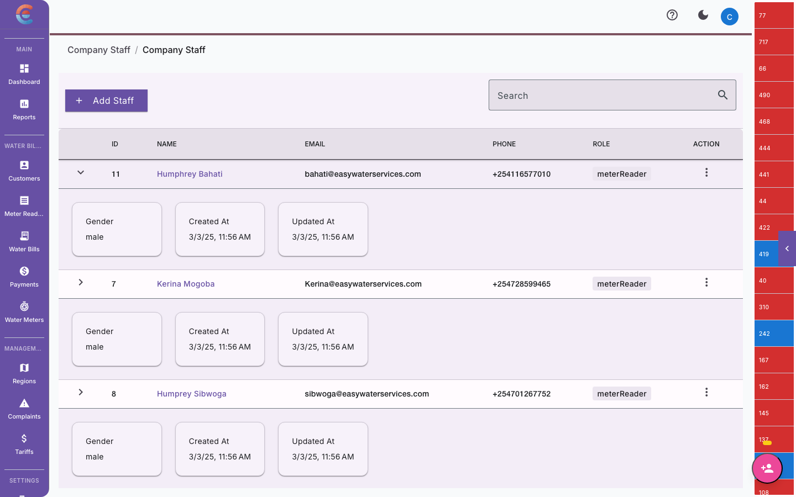

import { Steps, Tabs, TabItem } from '@astrojs/starlight/components';

Your EasyBiller company account supports multiple team members, each with a specific role that controls what they can see and do. This guide covers how to manage your team from the dashboard.

## Understanding roles

Every team member is assigned exactly one role. Roles determine which sections of the dashboard are visible, what actions are available, and what data is accessible.

### Role summary

| Role | Description | Typical user |
|---|---|---|
| **SuperAdmin** | Full platform access across all companies. Can manage companies, billing configuration, and all users. | Platform owner, IT administrator |
| **Admin** | Full access within a single company. Can manage team members, billing, payments, customers, and settings. | Company director, operations manager |
| **Manager** | Operational access. Can manage customers, meters, readings, and bills. Cannot change company settings or manage team members. | Regional manager, area supervisor |
| **Meter Reader** | Field-focused access. Can view assigned routes, capture readings, and report issues through the EasyBill mobile app. Limited dashboard access. | Field technician, meter reader |
| **Accountant** | Financial access. Can view and manage bills, payments, receipts, and financial reports. Cannot modify customers or meter data. | Finance officer, billing clerk |

### Detailed permissions

<Tabs>
  <TabItem label="SuperAdmin">
    **Full platform access**

    - Create, edit, and delete companies
    - Manage all users across all companies
    - Configure billing cycles, tariffs, and pricing
    - Manage payment integrations (M-Pesa, bank)
    - View all financial reports and exports
    - Access audit logs
    - Manage SMS and notification settings
    - Configure feature flags and metadata

    :::caution[SuperAdmin scope]
    SuperAdmin is a platform-level role. Most organizations have only one or two SuperAdmin accounts. This role should be reserved for the person responsible for the overall EasyBiller deployment.
    :::
  </TabItem>
  <TabItem label="Admin">
    **Full company access**

    - Invite and remove team members within their company
    - Assign and change roles (except SuperAdmin)
    - Create and manage customers and meters
    - Capture and edit meter readings
    - Generate and send bills
    - Record and reconcile payments
    - Configure company settings (billing, SMS, payment)
    - View company financial reports
    - Manage routes and assignments
  </TabItem>
  <TabItem label="Manager">
    **Operational access**

    - Create and manage customers and meters
    - Capture and review meter readings
    - Assign routes to meter readers
    - Generate bills (but not change billing configuration)
    - Record payments
    - View operational reports
    - Cannot manage team members or company settings
  </TabItem>
  <TabItem label="Meter Reader">
    **Field access**

    - View assigned routes and customer lists
    - Capture meter readings (mobile app and dashboard)
    - Take and upload photos
    - Report issues (inaccessible meters, damage, tampering)
    - View own reading history
    - Cannot view financial data, bills, or payments
    - Cannot modify customer records
  </TabItem>
  <TabItem label="Accountant">
    **Financial access**

    - View all bills and payment records
    - Record manual payments
    - Reconcile M-Pesa transactions
    - Generate financial reports and exports
    - Issue receipts and credit notes
    - View customer balances and payment history
    - Cannot modify meter data, readings, or customer details
    - Cannot manage team members or company settings
  </TabItem>
</Tabs>

## Inviting new members

Admins and SuperAdmins can invite new team members to their company.

<Steps>
  1. **Go to Settings > Team Management** in the dashboard sidebar.

  2. **Click "Invite Member".** A form appears.

  3. **Enter the person's details:**
     - **Full name** — as it should appear in the system
     - **Email address** — used for login and notifications
     - **Phone number** — used for SMS notifications and mobile app sign-in (optional)
     - **Role** — select from the dropdown

     

  4. **Click "Send Invitation".** The person receives an email with a link to set their password and activate their account.

  5. **Track invitation status.** The Team Management table shows invited members with a "Pending" badge until they accept.
</Steps>

:::note[Invitation expiry]
Invitation links expire after 72 hours. If a team member does not accept in time, you can resend the invitation from the Team Management screen by clicking the three-dot menu next to their name and selecting "Resend Invitation."
:::

### Inviting a Meter Reader

When you invite someone with the **Meter Reader** role, they primarily use the **EasyBill mobile app**. After accepting the invitation:

1. They download EasyBill from the App Store or Play Store.
2. They sign in with the email and password they set during invitation acceptance.
3. You assign them to a route (see [Capturing Meter Readings](/water-billing/meter-readings/) for route management).
4. Their assigned customers appear in the app after the first sync.

## Editing a team member

<Steps>
  1. Go to **Settings > Team Management**.
  2. Find the team member in the list. Use the search bar to filter by name or email.
  3. Click the **three-dot menu** on their row and select **"Edit"**.
  4. Update their name, email, phone number, or role as needed.
  5. Click **"Save Changes"**.
</Steps>

:::caution[Role changes take effect immediately]
When you change someone's role, their permissions update the next time they load a page or sync the mobile app. If you downgrade a user from Admin to Meter Reader, they will lose access to billing and settings sections immediately.
:::

## Changing a member's role

Role changes follow the same edit flow described above. Select the new role from the dropdown and save.

**Important considerations:**

- **Upgrading** (for example, Meter Reader to Manager) grants additional permissions immediately.
- **Downgrading** (for example, Admin to Accountant) removes permissions immediately. The user will see an "Access Denied" message if they try to visit a section their new role does not allow.
- Only **SuperAdmins** can assign or remove the Admin role.
- The **SuperAdmin** role can only be assigned by another SuperAdmin.
- You **cannot change your own role**. Ask another admin or SuperAdmin to do this.

## Deactivating a team member

When someone leaves your organization or no longer needs access, deactivate their account instead of deleting it. Deactivation preserves their historical data (readings captured, payments recorded) while preventing future access.

<Steps>
  1. Go to **Settings > Team Management**.
  2. Find the team member and click the **three-dot menu**.
  3. Select **"Deactivate"**.
  4. Confirm the action in the dialog. You can add a reason for your records.
</Steps>

**What happens when you deactivate a user:**
- They can no longer sign in to the dashboard or mobile app.
- Their name remains on historical records (readings, payments, audit logs).
- Any pending route assignments are unassigned and returned to the assignment pool.
- Their invitation link (if still pending) is invalidated.

### Reactivating a user

If you need to restore access, find the deactivated user in the Team Management list (toggle the **"Show deactivated"** filter), click the three-dot menu, and select **"Reactivate"**. Their original role is restored, and they can sign in again with their existing credentials.

## Best practices for access control

### Principle of least privilege

Give each team member only the access they need. A meter reader does not need to see financial reports. An accountant does not need to edit meter data. This reduces the risk of accidental changes and keeps the interface cleaner for each user.

### Separate admin accounts

If you are the company owner, create a personal **Admin** account for daily work and keep the **SuperAdmin** account for administrative tasks only. This reduces exposure if your daily-use credentials are compromised.

### Review team members regularly

At least once a quarter, review your Team Management list:

- **Remove or deactivate** accounts for people who have left.
- **Verify roles** are still appropriate — has someone changed responsibilities?
- **Check pending invitations** — resend or cancel stale invitations.

### Use descriptive names

When inviting members, use their full real names. This makes audit logs readable and helps identify who performed actions across the system.

### Secure credentials

- Encourage team members to use strong, unique passwords.
- Do not share login credentials between people. Each person should have their own account.
- If you suspect an account has been compromised, deactivate it immediately and create a new invitation.

## Troubleshooting

### "I invited someone but they did not receive the email"

- Check that you entered the correct email address. Edit the invitation to verify.
- Ask the person to check their spam or junk folder.
- Resend the invitation from the three-dot menu.
- If the issue persists, the email domain may be blocking messages from EasyBiller. Contact support for alternative delivery options.

### "A team member cannot see certain features"

Their role may not include access to that feature. Check the [role permissions](#detailed-permissions) above and verify they have the correct role assigned.

### "I cannot change my own role"

This is by design. Ask another Admin or SuperAdmin in your company to update your role.

### "Deactivated user still appears in reports"

This is expected. Deactivation prevents future access but preserves historical records. The user's name will continue to appear on readings and transactions they previously created.

## Next steps

- **[Company Settings](/account/company-settings/)** — configure your company profile, billing, and integrations.
- **[Notifications](/account/notifications/)** — set up SMS and email alerts for your team.
- **[Admin Onboarding Guide](/guides/admin-onboarding/)** — full walkthrough for new administrators.
