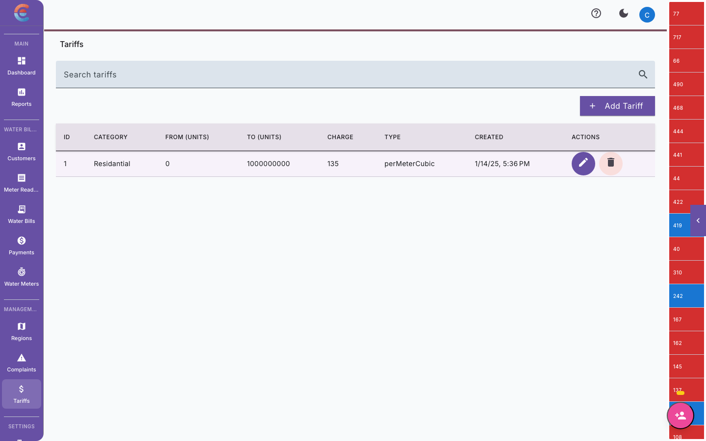

import { Steps, Tabs, TabItem, Aside } from '@astrojs/starlight/components';

This guide walks you through everything you need to do to get your water utility company fully operational on EasyBiller. By the end, you will have a configured billing system, your first customer on record, M-Pesa payments connected, and SMS notifications ready to send.

Set aside about 30-45 minutes. You can also complete these steps across multiple sessions — your progress is saved automatically.

<Aside type="tip">
You do not need to complete every step before your team can start working. Steps 1-7 (through adding your first customer) are enough to begin capturing meter readings. You can configure payments and notifications later.
</Aside>

## Your setup checklist

<Steps>

1. **Register your company**

   Go to [app.easybiller.com/register](https://app.easybiller.com/register) and fill in your company details:

   | Field | What to enter |
   |---|---|
   | **Company name** | Your registered business name (e.g., "Maji Safi Water Company") |
   | **Admin email** | Your work email address. This becomes the super admin account. |
   | **Password** | At least 8 characters. Use a mix of letters, numbers, and symbols. |
   | **Country** | Select your country from the dropdown. |
   | **Currency** | Choose your billing currency. |

   Click **Create Account** to submit your registration.

   

   <Aside type="caution">
   Choose your currency carefully. Changing it later affects all existing billing records and is not recommended after you have started generating bills.
   </Aside>

2. **Verify your email**

   Check your inbox for a verification email from EasyBiller. Click the **Verify Email** button in the message to activate your account.

   <Aside type="tip">
   Did not receive the email? Check your spam or junk folder. If it is still not there, return to the login page and click **Resend Verification Email**. The link expires after 24 hours.
   </Aside>

3. **Log in and explore the dashboard**

   Go to [app.easybiller.com](https://app.easybiller.com) and sign in with your admin email and password.

   Take a moment to orient yourself:

   - The **sidebar** on the left is your main navigation. It groups features into sections: Dashboard, Customers, Meter Readings, Billing, Payments, Properties, Reports, and Settings.
   - The **Dashboard** page shows a summary of your current billing cycle, recent activity, and key metrics. It will be empty right now — that is expected.
   - The **company switcher** at the top left shows your company name. If you manage multiple companies, you can switch between them here.

   When you are ready, head to **Settings** to begin configuration.

4. **Configure billing settings**

   Navigate to **Settings > Billing Configuration**. This is where you define how your billing cycles work.

   | Setting | What it controls | Example |
   |---|---|---|
   | **Billing cycle length** | How many days each billing cycle lasts | 30 days (monthly billing) |
   | **Reading start day** | The day of the month when field staff should begin capturing readings | Day 20 |
   | **Reading deadline** | The last day to submit readings before bills are generated | Day 28 |
   | **Bill generation day** | The day bills are calculated and created | Day 1 of the next month |
   | **Payment due date** | How many days after bill generation customers have to pay | 14 days |

   Fill in each field based on your company's billing rhythm. Most utilities in the region use a monthly cycle with readings captured in the last 10 days of the month.

   Click **Save** when you are done.

   <Aside type="note">
   You can adjust these settings later, but changes only apply to future billing cycles. Any cycle already in progress will keep its original dates.
   </Aside>

5. **Set up pricing and tariffs**

   Navigate to **Settings > Pricing / Tariffs**. This is where you define how much customers pay per unit of water consumed.

   EasyBiller supports **tiered pricing**, which means you can charge different rates based on consumption bands. This is a common model for water utilities.

   

   Here is an example of a tiered tariff structure (actual rates are determined by your utility based on your policies and regulatory requirements):

   | Tier | Consumption range | Rate per unit |
   |---|---|---|
   | Tier 1 | 0 - 10 m3 | Your rate |
   | Tier 2 | 11 - 30 m3 | Your rate |
   | Tier 3 | 31 - 60 m3 | Your rate |
   | Tier 4 | 61+ m3 | Your rate |

   To create your tariff:

   1. Click **Add Tariff Tier**.
   2. Enter the **minimum** and **maximum** consumption for the tier (in cubic meters).
   3. Enter the **rate per unit** in your currency.
   4. Repeat for each tier.
   5. Click **Save Tariff**.

   <Aside type="tip">
   You can also set a **standing charge** (a fixed monthly fee applied to every customer regardless of consumption). This covers infrastructure and maintenance costs. Add it under the "Fixed Charges" section on the same page.
   </Aside>

   <Aside type="caution">
   Double-check your rates before saving. Tariff changes apply to the next billing cycle, so incorrect rates could affect an entire month of bills if not caught early.
   </Aside>

6. **Create your first region**

   Navigate to **Customers > Regions** and click **Add Region**.

   Regions help you organize customers by geographic area. They are also used to assign routes to field meter readers.

   Enter a **region name** that your team will recognize — for example, "Kilimani", "Westlands", or "Zone A". You can optionally add a description.

   Click **Save** to create the region.

   <Aside type="note">
   You can create as many regions as you need. Most companies start with a few and add more as they grow. Regions can be renamed or reorganized later without affecting customer records.
   </Aside>

7. **Add your first customer and meter**

   Navigate to **Customers** and click **Add Customer**.

   Fill in the customer details:

   | Field | What to enter |
   |---|---|
   | **Full name** | Customer's name as it should appear on bills |
   | **Phone number** | Mobile number for SMS notifications (e.g., 0712345678) |
   | **Email** | Optional. Used for email notifications if enabled. |
   | **Region** | Select the region you created in Step 6 |
   | **Account number** | A unique identifier for this customer (e.g., "MSW-001"). Some companies use their own numbering; others let the system auto-generate. |

   After saving the customer, you will be prompted to **add a meter**:

   | Field | What to enter |
   |---|---|
   | **Meter number** | The serial number printed on the physical meter |
   | **Meter type** | Select "Analog" for standard dial meters |
   | **Initial reading** | The current reading on the meter at the time of registration |
   | **Installation date** | The date the meter was installed or registered |

   Click **Save** to link the meter to the customer.

   <Aside type="tip">
   If you are migrating from another system and need to add customers in bulk, contact support at support@easybiller.com. We can help you import your existing customer list from a spreadsheet.
   </Aside>

   You now have a working billing setup. Field staff can start capturing readings for this customer, and you can generate bills once a full cycle is complete.

8. **Configure M-Pesa payment settings**

   Navigate to **Settings > Payments > M-Pesa Configuration**.

   To receive payments through Safaricom M-Pesa, you will need your business's paybill credentials:

   | Field | What to enter |
   |---|---|
   | **Paybill number** | Your Safaricom Business paybill number (e.g., 123456) |
   | **Consumer key** | From your Safaricom Daraja developer portal |
   | **Consumer secret** | From your Safaricom Daraja developer portal |
   | **Passkey** | The Lipa Na M-Pesa Online passkey from Daraja |
   | **Callback URL** | Auto-filled by EasyBiller. Do not change this unless instructed by support. |

   Click **Test Connection** to verify your credentials are working. You should see a green "Connection successful" confirmation.

   Then click **Save**.

   <Aside type="caution">
   Keep your consumer key, consumer secret, and passkey confidential. Never share them over email or messaging apps. If you suspect they have been compromised, regenerate them immediately on the Daraja portal.
   </Aside>

   <Aside type="note">
   Do not have a Safaricom paybill yet? You can apply for one through Safaricom Business. The process typically takes 2-4 weeks. You can continue setting up everything else in the meantime.
   </Aside>

   Once connected, customers can pay their bills by sending money to your paybill number. Payments are matched to customer accounts automatically using the account number format you define (e.g., the customer's account number).

9. **Set up SMS notifications**

   Navigate to **Settings > Notifications > SMS Configuration**.

   EasyBiller uses [Africa's Talking](https://africastalking.com) to send SMS messages to your customers. You will need an Africa's Talking account.

   | Field | What to enter |
   |---|---|
   | **API key** | From your Africa's Talking dashboard |
   | **Username** | Your Africa's Talking application username |
   | **Sender ID** | A short name that appears as the sender on customer phones (e.g., "MajiSafi"). Must be registered and approved by Africa's Talking. |

   Click **Test SMS** to send a test message to your own phone number. Confirm you receive it before saving.

   Then click **Save**.

   <Aside type="tip">
   Sender ID registration with Africa's Talking can take a few days. While you wait, you can use the default sender ID for testing. Just remember to update it before sending real customer notifications.
   </Aside>

   Once configured, the platform can automatically send:
   - **Bill notifications** — Sent when a new bill is generated.
   - **Payment confirmations** — Sent when a customer's M-Pesa payment is received.
   - **Overdue reminders** — Sent when a bill passes its due date without full payment.
   - **Disconnection warnings** — Optional. Sent before service disconnection for chronic non-payment.

   You can enable or disable each notification type under **Settings > Notifications > Notification Preferences**.

10. **Invite your team members**

    Navigate to **Settings > Team Management** and click **Invite Member**.

    Enter the team member's email address and assign them a role:

    | Role | What they can do |
    |---|---|
    | **Admin** | Full access to all settings, billing, payments, and team management. |
    | **Office Staff** | Access to customers, meter readings, billing, and payments. Cannot change company settings or manage team. |
    | **Field Reader** | Access to the EasyBill mobile app only. Can view assigned routes and submit meter readings. Cannot access the web dashboard billing or payment sections. |

    Click **Send Invite**. The team member will receive an email with a link to create their account and set a password.

    <Aside type="tip">
    Start by inviting one person from each role to test the workflow end-to-end before rolling out to your full team. This lets you catch any configuration issues early.
    </Aside>

    <Aside type="note">
    Team members with the **Field Reader** role should also download the EasyBill mobile app. Share the [Field Staff Quick Start](/getting-started/field-staff-quick-start/) guide with them to get started.
    </Aside>

</Steps>

## You are all set

Congratulations — your company is now fully configured on EasyBiller. Here is a quick summary of what you have done:

| Step | Status |
|---|---|
| Company registered and verified | Done |
| Billing cycle configured | Done |
| Tariff tiers defined | Done |
| First region created | Done |
| First customer and meter added | Done |
| M-Pesa payments connected | Done |
| SMS notifications configured | Done |
| Team members invited | Done |

## What to do next

Now that your company is set up, here are the guides your team will need:

- **For your field readers** — Share the [Field Staff Quick Start](/getting-started/field-staff-quick-start/) so they can download EasyBill and start capturing readings.
- **For billing operations** — Read [Generating Bills](/water-billing/generating-bills/) to learn how to run your first billing cycle.
- **For payment tracking** — See [Recording Payments](/water-billing/payments/) to understand how M-Pesa reconciliation works.
- **For property managers** — If you also manage rental properties, head to [Property & Unit Setup](/real-estate/property-setup/) to configure the real estate module.

<Aside type="note" title="Need help?">
If you run into any issues during setup, email us at support@easybiller.com or use the in-app chat widget (bottom-right corner of the dashboard). Our support team is available Monday through Friday, 8:00 AM to 6:00 PM EAT.
</Aside>
