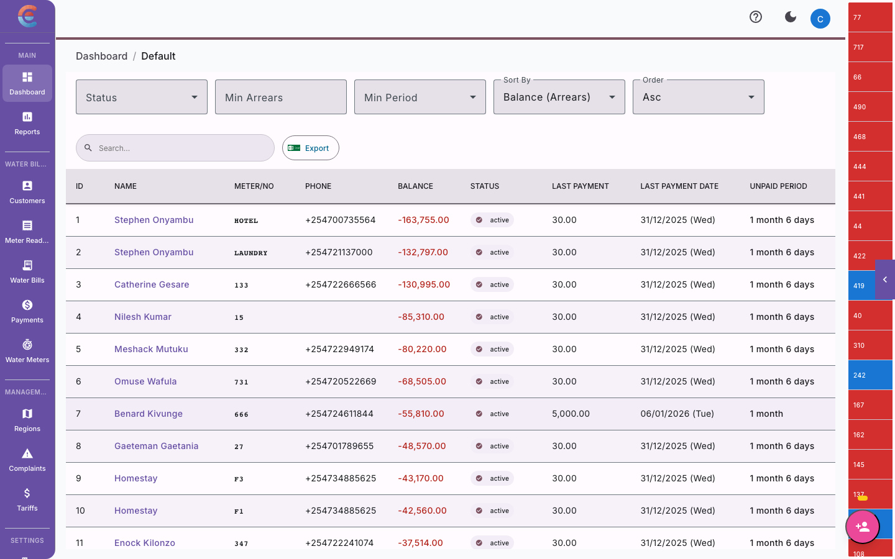
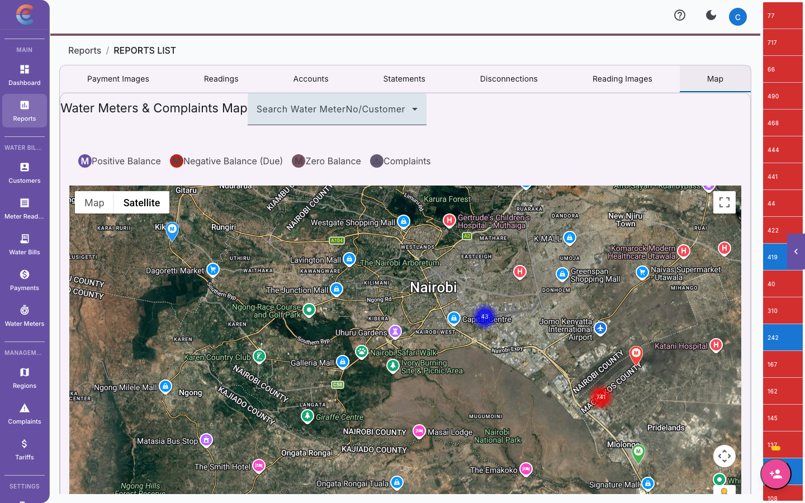
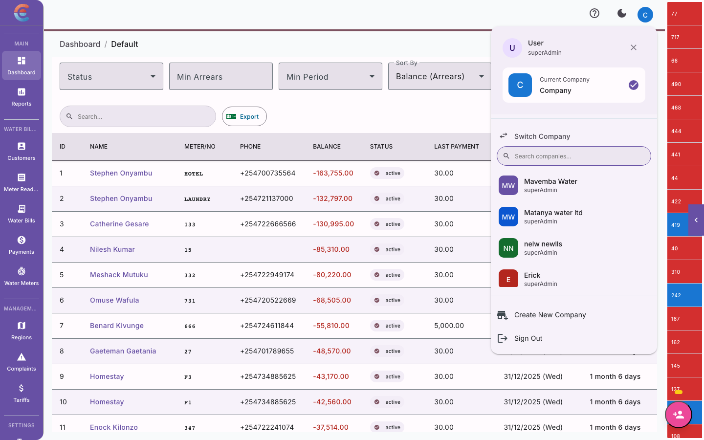

import { Steps, Tabs, TabItem, Aside } from '@astrojs/starlight/components';

EasyBiller is a billing and property management platform built for water utility companies and property managers. It brings together everything you need to run your operations — meter readings, billing cycles, mobile money payments, SMS notifications, and tenant management — in one connected system.

Whether you manage a small community water scheme or a large urban utility, the platform scales to fit your workflow.

## What EasyBiller does

At its core, EasyBiller solves three problems:

1. **Water billing** — Capture meter readings, calculate consumption, generate bills, and collect payments through M-Pesa. No more spreadsheets or manual invoices.
2. **Property management** — Track properties, units, tenants, and leases. Attach water meters to specific units so bills go to the right people.
3. **Field operations** — Equip your meter readers with a mobile app that works offline. Readings sync automatically when they are back in coverage.

These three capabilities are tightly integrated. A meter reading captured in the field flows into a billing cycle on the dashboard, which triggers an SMS to the tenant, who pays via M-Pesa — and the payment is reconciled automatically.

## The three components

EasyBiller is made up of three parts that work together seamlessly.

<Tabs>
  <TabItem label="Web Dashboard">
    The **Web Dashboard** is your command center. This is where admins and office staff manage day-to-day operations.

    From the dashboard you can:
    - Configure billing cycles, pricing tiers, and deadlines
    - Add and manage customers, meters, and regions
    - Generate and distribute bills
    - Record and reconcile M-Pesa payments
    - Manage properties, units, tenants, and leases
    - Invite team members and assign roles
    - View reports and analytics

    The dashboard runs in any modern web browser. There is nothing to install.
  </TabItem>

  <TabItem label="Water Billing Backend">
    The **Water Billing Backend** handles the heavy lifting behind your billing operations.

    It manages:
    - Meter reading storage and anomaly detection
    - Billing cycle automation (reading periods, deadlines, generation)
    - Tiered water pricing and tariff calculations
    - M-Pesa payment processing and reconciliation
    - SMS and email notification dispatch
    - Customer and meter record management
    - Region-based organization

    You interact with the billing backend through the Web Dashboard — you never need to touch it directly.
  </TabItem>

  <TabItem label="EasyBill Mobile App">
    **EasyBill** is the companion mobile app for field meter readers. It is available on Android and iOS.

    With EasyBill, field staff can:
    - View their assigned route and customer list
    - Enter meter readings from analog dials
    - Take photo proof of each meter
    - Submit readings even without an internet connection (offline mode)
    - Sync all captured data once they are back online

    EasyBill is designed for speed. A trained reader can capture a reading in under 30 seconds.
  </TabItem>
</Tabs>

## How the components connect

Here is the typical flow of data through the platform:

<Steps>

1. **Field reader captures a reading**

   Using the EasyBill mobile app, your field staff visits a customer's meter, enters the current reading, and snaps a photo. The data is submitted (or queued for sync if offline).

2. **Dashboard receives the reading**

   The reading appears in the Web Dashboard under the relevant billing cycle. The system calculates consumption by comparing the new reading against the previous one.

3. **Bills are generated**

   When the billing cycle closes, the platform calculates each customer's charges based on your configured tariff tiers. Bills are generated in bulk.

4. **Customers are notified**

   SMS and/or email notifications are sent to customers with their bill details, amount due, and payment instructions.

5. **Payments are collected and reconciled**

   Customers pay via M-Pesa using your company's paybill number. The platform matches incoming payments to customer accounts automatically.

</Steps>

## Key capabilities

### Billing cycles
Define reading periods, bill generation deadlines, and payment due dates. The platform guides your team through each cycle step by step.

### Tiered water pricing
Set up tariff bands so customers pay different rates based on consumption. For example, the first 10 cubic meters at one rate, the next 20 at another, and so on.

### M-Pesa payments
Connect your Safaricom paybill number to receive and reconcile mobile money payments automatically. Customers pay from their phone — no bank visit required.

### SMS notifications
Send bill reminders, payment confirmations, and overdue notices to customers by SMS. Configure your Africa's Talking credentials and customize your sender ID.

### Meter reading capture
Record readings through the Web Dashboard or the EasyBill mobile app. The system flags anomalies (unusual spikes or drops) so your team can investigate before billing.

### Property and tenant management
Organize your service area into properties and units. Assign tenants, track leases, and link water meters to specific units for accurate billing.

### Team management
Invite office staff, billing clerks, and field readers to your company account. Control what each role can see and do.

## Navigating the dashboard

When you log into the Web Dashboard, you will see a sidebar on the left with these main sections:

| Section | What you will find |
|---|---|
| **Dashboard** | At-a-glance summary of your billing cycles, recent payments, and outstanding balances. |
| **Customers** | Your customer list. Add, edit, or search for customers and their meters. |
| **Meter Readings** | All captured readings for the current and past billing cycles. Flag and resolve anomalies here. |
| **Billing** | Create and manage billing cycles. Generate bills, review charges, and distribute invoices. |
| **Payments** | Record manual payments, view M-Pesa transactions, and reconcile your accounts. |
| **Properties** | Manage properties, units, and tenants. Available if your company uses the real estate module. |
| **Reports** | Revenue summaries, consumption trends, and payment collection reports. |
| **Settings** | Company profile, billing configuration, pricing tiers, M-Pesa setup, SMS settings, and team management. |

<Aside type="tip">
Use the company switcher at the top of the sidebar if you manage multiple water companies or properties. You can search for a company by name to find it quickly.
</Aside>

## System requirements

<Tabs>
  <TabItem label="Web Dashboard">
    - **Browser**: Google Chrome, Mozilla Firefox, Microsoft Edge, or Safari (latest two versions)
    - **Screen size**: Works on tablets and desktops. A screen width of 1024px or larger is recommended for the best experience.
    - **Internet**: A stable internet connection is required for the dashboard.
  </TabItem>

  <TabItem label="EasyBill Mobile App">
    - **Android**: Version 8.0 (Oreo) or later
    - **iOS**: Version 14.0 or later
    - **Storage**: At least 100 MB of free space
    - **Camera**: Required for meter photo capture
    - **Internet**: Works offline. Readings sync when you reconnect to the internet.
  </TabItem>
</Tabs>

<Aside type="note">
EasyBiller does not require any desktop software installation. The entire platform runs in your browser and on the mobile app.
</Aside>

## What to do next

Ready to get started? Choose the guide that matches your role:

- **Company administrators** — Follow the [Admin Quick Start](/getting-started/admin-quick-start/) to set up your company, configure billing, and invite your team.
- **Field meter readers** — Head to the [Field Staff Quick Start](/getting-started/field-staff-quick-start/) to learn the EasyBill mobile workflow.
- **Tenants and customers** — See the [Tenant Quick Start](/getting-started/tenant-quick-start/) to understand your bill and make payments.
