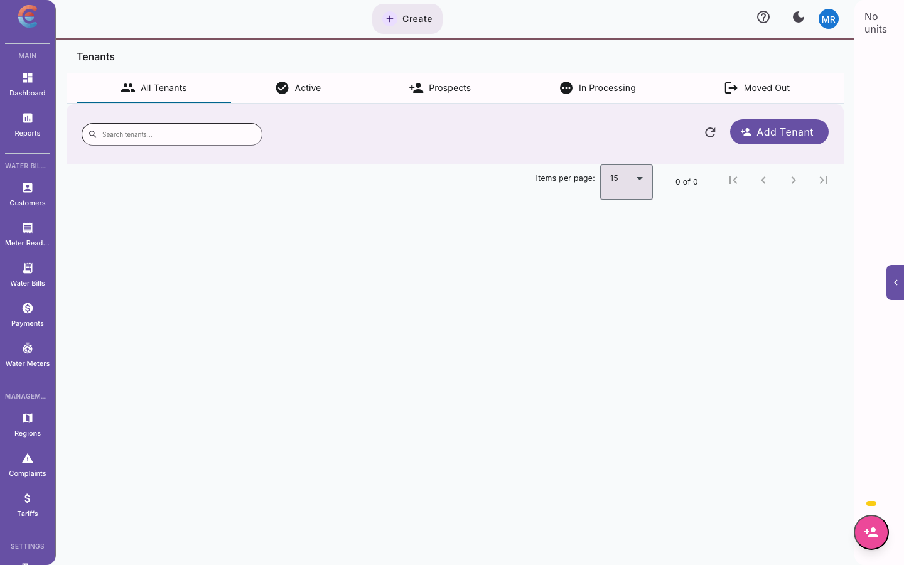
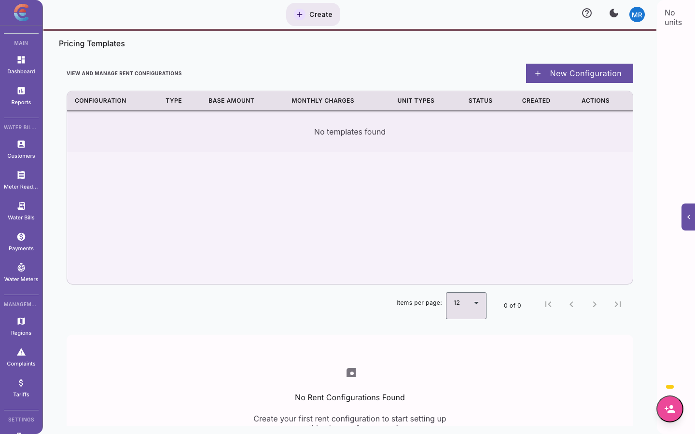

import { Steps, Tabs, TabItem } from '@astrojs/starlight/components';

A lease is the formal agreement between you and your tenant. It defines the unit, the duration, the rent, and the financial obligations on both sides. This guide covers every stage of the lease lifecycle, from creation through renewal or termination.

## Creating a new lease

Most leases are created during [tenant onboarding](/real-estate/tenant-onboarding). However, you may also need to create a standalone lease — for example, when renewing with different terms or when a tenant transfers to a new unit.

<Steps>

1. **Open the tenant's profile** and go to the **Leases** tab.

2. **Click Create Lease** and fill in the agreement details:

   | Field | Description | Guidance |
   |-------|-------------|---------|
   | **Unit** | The unit this lease is for | Only vacant units are shown, unless this is a renewal on the same unit |
   | **Start Date** | First day of the lease term | Typically the 1st of the month or the actual move-in date |
   | **End Date** | Last day of the lease term | Usually 12 months from start; some commercial leases are 24 or 36 months |
   | **Rent Amount** | Monthly rent | This is the billing amount. It can differ from the charge template if negotiated |
   | **Deposit Amount** | Security deposit required | Standard is 1-2 months' rent. Enter the total expected |
   | **Lease Status** | Current state of the lease | Active, Pending, or Draft |

3. **Attach lease document (optional)**

   Upload a signed PDF of the physical lease agreement for record-keeping.

4. **Review and save**

   Confirm the details and click **Save**. The lease is now active and charges will be generated based on it.

</Steps>

### Lease statuses explained

| Status | Meaning | Charges generated? |
|--------|---------|-------------------|
| **Draft** | Lease is being prepared, terms not finalized | No |
| **Pending** | Lease is signed but the start date has not arrived | No (charges begin on start date) |
| **Active** | Lease is in effect and the tenant is occupying the unit | Yes |
| **Expired** | Lease end date has passed without renewal or termination | Depends on your holdover policy |
| **Terminated** | Lease has been formally ended | No |

---

## Lease renewal process

When a lease approaches its end date, you have three options: renew, let it expire, or terminate. Here is how to handle a renewal.

### Automatic renewal reminders

The system sends reminders when a lease is approaching expiry:

| Reminder | When | Sent to |
|----------|------|---------|
| First notice | 90 days before expiry | Property manager |
| Second notice | 60 days before expiry | Property manager + tenant |
| Final notice | 30 days before expiry | Property manager + tenant |

### Renewing a lease

<Tabs>
<TabItem label="Same terms">

If the tenant is continuing under the same conditions:

<Steps>

1. Open the tenant's profile and go to the **Leases** tab.

2. Click **Renew** on the expiring lease.

3. The system pre-fills all fields with the current lease terms. Adjust the **Start Date** (day after current lease ends) and **End Date** (typically 12 months later).

4. Review and click **Confirm Renewal**.

5. The old lease status changes to **Expired** and the new lease becomes **Active**.

</Steps>

</TabItem>
<TabItem label="Updated terms">

If the rent, deposit, or other terms are changing:

<Steps>

1. Open the tenant's profile and go to the **Leases** tab.

2. Click **Renew** on the expiring lease.

3. Update the fields that are changing:
   - **Rent Amount** — Enter the new monthly rent (see [Rent Escalation](#rent-escalation) below)
   - **Deposit Amount** — If the deposit needs to increase, enter the new total
   - **End Date** — Set the new lease term

4. If the deposit is increasing, the system calculates the top-up amount the tenant needs to pay.

5. Review and click **Confirm Renewal**.

</Steps>

</TabItem>
</Tabs>

:::tip[Start renewals early]
Begin the renewal conversation at least 60 days before lease expiry. This gives both sides time to negotiate terms and avoids awkward holdover situations where a tenant is staying without a valid lease.
:::

---

## Lease termination and move-out

When a tenant is leaving — whether the lease has expired, the tenant is breaking the lease early, or you are not renewing — follow this process to cleanly close out the tenancy.

<Steps>

1. **Initiate termination**

   Open the tenant's lease and click **Terminate Lease**. Select the reason:
   - Lease expired (natural end)
   - Tenant notice (voluntary departure)
   - Landlord notice (non-renewal)
   - Lease violation
   - Mutual agreement

2. **Set the move-out date**

   Enter the actual date the tenant will vacate (or has vacated) the unit. This determines the final billing period.

3. **Generate final statement**

   The system calculates:
   - Prorated rent for the final partial month (if applicable)
   - Any outstanding charges or unpaid balances
   - Deposit balance and potential deductions

4. **Conduct unit inspection**

   Inspect the unit and record any damage or cleaning requirements. Enter estimated repair costs that will be deducted from the deposit.

5. **Process final settlement**

   The settlement summary shows:

   | Item | Amount |
   |------|--------|
   | Outstanding rent | KES 5,000 |
   | Unpaid utilities | KES 1,200 |
   | Repair deductions | KES 3,500 |
   | **Total deductions** | **KES 9,700** |
   | Deposit held | KES 70,000 |
   | **Refund due to tenant** | **KES 60,300** |

6. **Close the lease**

   Click **Confirm Termination**. The lease status changes to **Terminated** and the unit status changes to **Vacant**, making it available for new tenants.

</Steps>

:::caution[Document everything]
Take photos during the move-out inspection and attach them to the lease record. Clear documentation protects both you and the tenant if there are disputes about deposit deductions.
:::

---

## Handling deposit refunds

After lease termination, the deposit refund follows this workflow:

<Steps>

1. **Review the final settlement**

   The termination process (above) calculates the refund amount after all deductions.

2. **Approve the refund**

   A user with the appropriate permissions must approve the refund amount. This prevents unauthorized or incorrect refunds.

3. **Process the payment**

   <Tabs>
   <TabItem label="M-Pesa refund">

   Enter the tenant's M-Pesa phone number and initiate the refund. The system sends the money directly and records a confirmation.

   </TabItem>
   <TabItem label="Bank transfer">

   Enter the tenant's bank details (bank name, account number) and process the transfer. Record the bank reference number once complete.

   </TabItem>
   </Tabs>

4. **Record the refund**

   The system updates the deposit status to **Refunded** and generates a refund receipt that is sent to the tenant via SMS and email.

5. **Close the deposit record**

   The tenant's profile now shows the complete deposit history: amount collected, deductions applied, and refund processed.

</Steps>

### Partial deposit forfeiture

In some cases, the entire deposit is consumed by outstanding balances and repair costs. When deductions equal or exceed the deposit:

- The deposit status is set to **Forfeited**
- The tenant receives a breakdown showing how the deposit was applied
- Any remaining balance owed by the tenant appears as an outstanding charge on their final statement

---

## Lease document management

Keep all lease-related documents organized and accessible within the system.

### Uploading documents

From the tenant's lease detail page, click **Upload Document** and attach:

- Signed lease agreement (PDF)
- Tenant ID copy
- Move-in inspection report with photos
- Move-out inspection report with photos
- Any addendums or amendments to the original lease
- Correspondence related to the lease

### Document best practices

- **Name files clearly** — Use a consistent format like `Lease_UnitA101_JaneMuthoni_2026.pdf`
- **Upload at the time of signing** — Do not let documents pile up. Upload immediately.
- **Store inspection photos** — Both move-in and move-out photos attached to the lease create an unambiguous record.
- **Version control** — If a lease is amended, upload the amendment as a separate document rather than replacing the original.

---

## Tracking lease expiry dates

Staying ahead of lease expirations prevents vacancy gaps and holdover situations.

### The Lease Expiry Dashboard

Go to **Real Estate > Leases > Expiry Tracker** to see:

- All leases expiring in the next 30, 60, and 90 days
- Lease status (renewal initiated, pending discussion, no action yet)
- Tenant contact details for quick outreach
- Filter by property or unit type

### Setting up expiry alerts

In **Settings > Notifications > Lease Alerts**, configure who receives reminders and when:

| Alert | Default timing | Customizable? |
|-------|---------------|---------------|
| Manager reminder | 90, 60, 30 days before expiry | Yes |
| Tenant reminder | 60, 30 days before expiry | Yes |
| Urgent alert | 7 days before expiry (no action taken) | Yes |

### Handling expired leases with no renewal

If a lease expires and no renewal or termination has been processed:

- The lease status changes to **Expired**
- The unit remains occupied (the tenant has not moved out)
- Depending on your configuration, the system can either:
  - **Continue generating charges** (holdover/month-to-month basis)
  - **Flag the lease** for immediate attention without generating charges

Configure this behavior in **Settings > Leases > Expiry Policy**.

---

## Rent escalation

Rent escalation handles scheduled rent increases, typically applied at lease renewal. There are two approaches.

<Tabs>
<TabItem label="Fixed amount increase">

A predetermined amount is added to the current rent at each renewal.

**Example:** Current rent is KES 35,000. A fixed escalation of KES 2,000 per year means the new rent is KES 37,000.

**Best for:** Simple residential properties where you want predictable, easy-to-communicate increases.

**How to configure:**

<Steps>

1. During lease renewal, update the **Rent Amount** field with the new figure.

2. In the **Escalation Notes** field, record the increase for audit purposes (e.g., "Annual escalation: +KES 2,000").

3. Save the renewed lease.

</Steps>

</TabItem>
<TabItem label="Percentage increase">

A percentage of the current rent is added at each renewal.

**Example:** Current rent is KES 35,000. A 10% annual escalation means the new rent is KES 38,500.

**Best for:** Commercial leases and properties in areas with variable market conditions.

**How to configure:**

<Steps>

1. During lease renewal, calculate the new rent: current rent multiplied by (1 + escalation percentage).

2. Enter the calculated amount in the **Rent Amount** field.

3. Record the escalation rate in **Escalation Notes** (e.g., "Annual escalation: 10%").

4. Save the renewed lease.

</Steps>

</TabItem>
</Tabs>

### Communicating rent increases

When you increase rent at renewal, clear communication prevents friction:

- **Notify in advance** — Include the new rent amount in the renewal notice, at least 30 days before the new lease starts.
- **Explain the rationale** — Reference market rates, inflation, or property improvements.
- **Provide a comparison** — Show the old and new amounts side by side so the tenant understands the change.
- **Put it in writing** — The lease renewal document should clearly state the updated rent.

---

## Transferring a lease between units

Occasionally, a tenant needs to move to a different unit within the same property — for example, upgrading from a 1-bedroom to a 2-bedroom, or moving to a ground-floor unit for accessibility reasons.

<Steps>

1. **Open the tenant's current lease** and click **Transfer Unit**.

2. **Select the new unit** from the available vacant units in the same property.

3. **Review the impact:**

   | Item | Old unit (A-101) | New unit (B-205) |
   |------|-----------------|-----------------|
   | Unit type | 1-Bedroom | 2-Bedroom |
   | Rent (from charge template) | KES 22,000 | KES 35,000 |
   | Garbage | KES 500 | KES 500 |
   | Water | KES 800 | KES 800 |

4. **Adjust the lease terms** if needed:
   - Update the rent amount to reflect the new unit
   - Adjust the deposit if the new unit requires a higher amount
   - Set the transfer effective date

5. **Confirm the transfer.** The system will:
   - Update the lease to reference the new unit
   - Change the old unit's status to **Vacant**
   - Change the new unit's status to **Occupied**
   - Apply the new unit's charge templates
   - Log the transfer in the lease history for audit purposes

</Steps>

:::note[Deposit difference]
If the new unit requires a higher deposit, the system calculates the difference and adds it as a charge on the tenant's next statement. If the deposit is lower, the excess is held as a credit.
:::

### When to transfer vs. terminate and re-lease

| Scenario | Recommendation |
|----------|---------------|
| Same property, simple unit change | **Transfer** — preserves payment history and lease continuity |
| Different property entirely | **Terminate and create new lease** — different property means different management context |
| Significant term changes (new duration, different deposit structure) | **Terminate and create new lease** — cleaner record of the new arrangement |
| Temporary relocation (e.g., during renovations) | **Transfer** with a note, then transfer back when the original unit is ready |

---

## Quick reference: lease lifecycle

Here is the full lifecycle of a lease at a glance:

| Stage | Action | Result |
|-------|--------|--------|
| **Creation** | Lease created during onboarding or manually | Status: Active or Pending |
| **Active period** | Charges generated monthly, payments recorded | Ongoing billing |
| **Expiry approaching** | System sends renewal reminders | 90/60/30 day alerts |
| **Renewal** | New lease created with updated terms | Old lease: Expired, New lease: Active |
| **Termination** | Move-out process, final settlement, deposit refund | Status: Terminated, Unit: Vacant |
| **Transfer** | Tenant moves to a different unit | Lease updated, old unit vacated |

---

## What to do next

You now have a complete understanding of the lease lifecycle. For day-to-day billing operations, refer to the [Rent Collection & Charges Guide](/real-estate/rent-and-charges). To revisit how properties and units are structured, see the [Property & Unit Setup Guide](/real-estate/property-setup).
