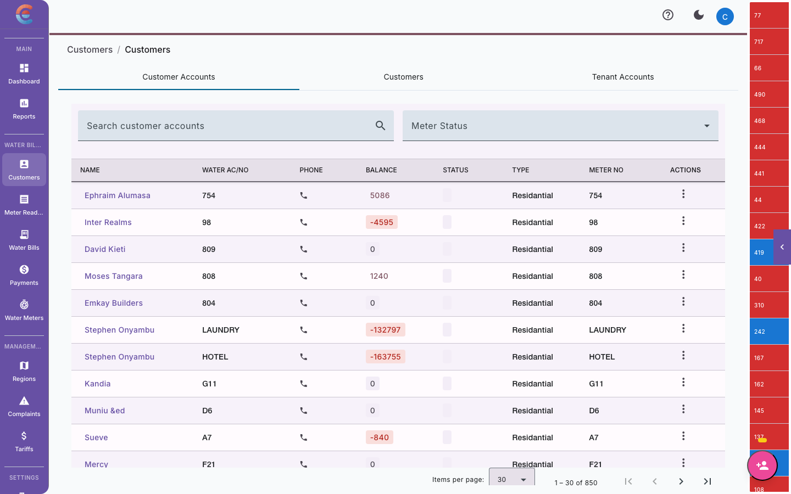
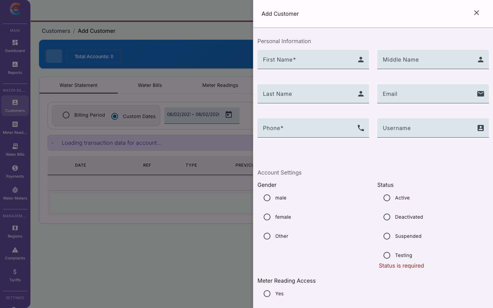
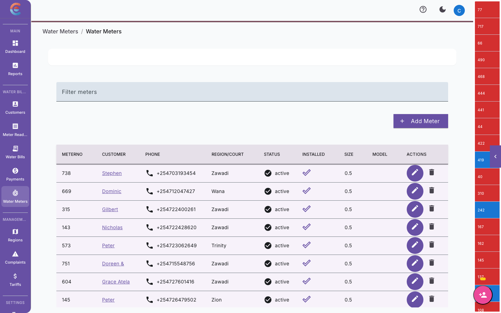
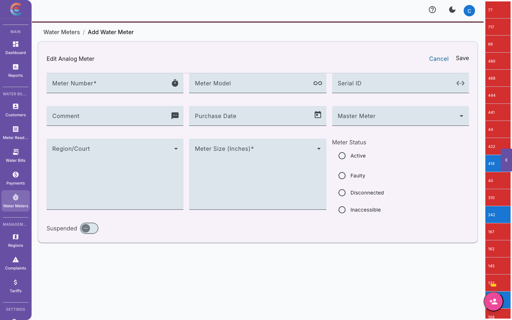

import { Steps, Tabs, TabItem } from '@astrojs/starlight/components';

Your customer database is the foundation of everything in EasyBiller — billing, readings, payments, and reporting all flow from accurate customer and meter records. This guide covers how to add customers, assign meters, organize your service area, and keep your records clean over time.



## Adding a new customer

Every customer in EasyBiller represents a single connection point — one household, business, or institution that receives water through a metered connection.

### Required information

| Field | Description | Example |
|---|---|---|
| **Full Name** | Customer's legal name or business name | Jane Wanjiku Muthoni |
| **Phone Number** | Primary mobile number (used for SMS billing) | 0712345678 |
| **National ID** | Government-issued ID number | 12345678 |
| **Region** | The service area where this customer is located | Kiambu Town |
| **Physical Address** | Description of the customer's location | Plot 45, Biashara Street |
| **Tariff** | The pricing structure applied to this customer | Residential - Urban |

### Optional information

| Field | Description |
|---|---|
| **Email** | For customers who prefer email communication |
| **Alternative Phone** | Backup contact number |
| **GPS Coordinates** | Latitude and longitude of the connection point |
| **Account Number** | Custom account number (auto-generated if left blank) |
| **Notes** | Internal notes about the customer |

### Step-by-step: Adding a customer



<Steps>

1. Navigate to **Customers** in the main menu.

2. Click **Add Customer**.

3. Fill in the customer's **full name** and **phone number**. The phone number is critical — it is used for SMS bill delivery and M-Pesa payment matching.

4. Enter the **National ID**. This helps prevent duplicate registrations and is required for regulatory compliance.

5. Select the **region** where this customer is located.

6. Enter the **physical address** or location description. Be specific enough that a field agent can find the connection point.

7. Select the appropriate **tariff**. This determines how the customer's water charges are calculated.

8. Optionally, add GPS coordinates if you have them. These are valuable for mapping and route planning.

9. Click **Save Customer**.

</Steps>

:::tip
Capture GPS coordinates during the initial site visit. They are difficult to gather retroactively and incredibly useful for planning reading routes, identifying service area coverage, and resolving location disputes.
:::

## Assigning a meter to a customer

A customer must have an assigned meter before you can record readings or generate bills. Each meter is linked to exactly one customer at a time.

### Meter information



| Field | Description | Example |
|---|---|---|
| **Meter Serial Number** | The manufacturer's serial number printed on the meter | WM-2024-00451 |
| **Meter Type** | The meter technology or size | Mechanical 15mm |
| **Initial Reading** | The reading on the meter at the time of installation | 00000 |
| **Installation Date** | When the meter was installed at this connection | 2024-03-15 |
| **Location Description** | Where the meter is physically located on the property | Front gate, left side |

### Step-by-step: Assigning a meter



<Steps>

1. Open the customer record by clicking on the customer's name in the customer list.

2. Go to the **Meter** tab or section.

3. Click **Assign Meter**.

4. Enter the **meter serial number**. Double-check this against the physical meter — an incorrect serial number creates tracking problems that are painful to fix later.

5. Select the **meter type** from the dropdown.

6. Enter the **initial reading** shown on the meter at the time of installation. For new meters, this is usually `00000`. For transferred meters, enter the reading at the time of transfer.

7. Set the **installation date**.

8. Add a **location description** to help field agents locate the meter during reading rounds.

9. Click **Save**.

</Steps>

:::caution
The **initial reading** is the baseline for all future consumption calculations. If you enter this incorrectly, the customer's first bill will be wrong. Always verify the initial reading against the physical meter before saving.
:::

### Replacing a meter

When a meter is damaged, obsolete, or suspected of inaccuracy, you need to replace it:

<Steps>

1. Open the customer record and go to the **Meter** section.

2. Record a **final reading** on the old meter.

3. Click **Replace Meter**.

4. Enter the new meter's serial number, type, and initial reading.

5. The system preserves the old meter's history and starts a fresh reading sequence for the new meter.

</Steps>

## Organizing customers by region

Regions are the primary way to organize your customer base geographically. Consistent region assignment makes everything easier — reading routes, billing reports, and field team management all depend on it.

### Best practices for region assignment

- **Assign during registration.** Make region a required field when adding new customers.
- **Use consistent naming.** Agree on region names with your team before you start. "Kiambu" and "Kiambu Town" as separate regions will cause confusion.
- **Match field reality.** Regions should reflect how your field agents actually work — areas they can cover in a day, natural geographic boundaries, or administrative zones.

### Viewing customers by region

1. Go to **Customers** in the main menu.
2. Use the **Region** filter dropdown to narrow the list.
3. The customer count and aggregate statistics update to reflect the selected region.

## Editing customer details

Customer information changes — people move, phone numbers change, tariff categories get updated.

<Steps>

1. Find the customer using the search bar or by browsing the customer list.

2. Click on the customer's name to open their record.

3. Click **Edit** or click directly on the field you want to change.

4. Update the relevant fields.

5. Click **Save Changes**.

</Steps>

### What you can change

| Field | Can edit? | Notes |
|---|---|---|
| Name | Yes | Update for corrections or name changes |
| Phone Number | Yes | Triggers re-verification for M-Pesa matching |
| National ID | Yes | Requires admin approval |
| Region | Yes | May affect field agent assignments |
| Physical Address | Yes | Update when customer provides better location info |
| Tariff | Yes | New tariff applies from the next billing cycle |
| GPS Coordinates | Yes | Can be updated anytime |
| Meter Serial | No | Use the meter replacement workflow instead |

:::note
Changing a customer's **tariff** does not retroactively affect past bills. The new tariff applies starting from the next billing cycle only.
:::

## Deactivating or disconnecting a customer

When a customer stops using your service — whether due to relocation, disconnection for non-payment, or voluntary termination — you deactivate their record rather than deleting it. This preserves billing history and audit trails.

### Deactivation vs. deletion

| Action | What happens | When to use |
|---|---|---|
| **Deactivate** | Customer record is hidden from active lists but preserved in the system. No new bills are generated. | Customer moves away, requests disconnection, or is disconnected for non-payment. |
| **Delete** | Permanently removes the record (if permitted by your role). | Only for duplicate or test records. Never delete a customer who has billing history. |

### How to deactivate

<Steps>

1. Open the customer record.

2. Click **Deactivate Customer** (or **Disconnect**, depending on the reason).

3. Select the **reason for deactivation** from the dropdown.

4. Record a **final meter reading** if one has not been taken recently.

5. The system generates a **final bill** for any outstanding consumption.

6. Click **Confirm**.

</Steps>

:::tip
If a disconnected customer later wants to reconnect, you can reactivate their record rather than creating a new one. This preserves their complete history.
:::

## Bulk operations

For utilities managing hundreds or thousands of customers, adding records one by one is impractical. EasyBiller supports bulk import via CSV files.

### CSV import format

Your CSV file should include the following columns:

```
full_name,phone_number,national_id,region,address,tariff,meter_serial,initial_reading
```

**Example rows:**

```csv
Jane Wanjiku,0712345678,12345678,Kiambu Town,Plot 45 Biashara St,Residential,WM-2024-00451,0
John Kamau,0723456789,87654321,Thika Road,House 12 Juja Farm,Residential,WM-2024-00452,0
Sunrise Hotel,0734567890,A12345,Kiambu Town,Thika Rd Junction,Commercial,WM-2024-00453,1250
```

### Importing customers

<Steps>

1. Go to **Customers > Import**.

2. Download the **CSV template** to ensure your columns match the expected format.

3. Fill in your customer data. Each row represents one customer.

4. Upload the completed CSV file.

5. The system validates each row and shows a **preview** with any errors highlighted (missing required fields, duplicate IDs, invalid phone numbers).

6. Fix any errors either in the preview or by re-uploading a corrected file.

7. Click **Import** to create all valid customer records.

</Steps>

:::caution
Before running a bulk import in production, test with a small batch of 5--10 records first. Verify that the imported data appears correctly — especially tariff assignments and meter serial numbers.
:::

## Customer search and filtering

As your customer base grows, efficient search and filtering becomes essential.

### Search

The search bar at the top of the customer list searches across:

- Customer name
- Phone number
- Account number
- Meter serial number
- National ID

Type any of these values (or a partial match) to find a customer quickly.

### Filters

Use the filter controls to narrow the customer list:

| Filter | Options |
|---|---|
| **Region** | All regions or a specific region |
| **Status** | Active, Inactive, Disconnected |
| **Tariff** | Filter by assigned tariff |
| **Balance** | Customers with outstanding balances, overpayments, or zero balance |

Filters can be combined. For example, you can view all **Active** customers in **Kiambu Town** with **outstanding balances**.

## Viewing customer history

Every customer record includes a complete history of their interactions with your utility.

### History tabs

| Tab | What it shows |
|---|---|
| **Readings** | All meter readings with dates, consumption, and any anomaly flags |
| **Bills** | Every bill generated for this customer, with tier breakdown and payment status |
| **Payments** | All payments received, including M-Pesa transactions and manual cash entries |
| **Notes** | Internal notes added by your team |

### Reading the timeline

The customer history is displayed as a timeline, with the most recent activity at the top. Each entry shows:

- **Date** of the event
- **Type** (reading, bill, payment)
- **Details** (consumption amount, bill total, payment amount)
- **Status** (paid, unpaid, partial, flagged)

This gives you a complete picture of a customer's relationship with your utility at a glance — useful for resolving disputes, identifying chronic late payers, and spotting billing anomalies.

## Tips for maintaining clean records

1. **Standardize data entry.** Agree on formats for names (uppercase? title case?), phone numbers (with or without country code?), and addresses.
2. **Audit regularly.** Once a quarter, review inactive customers and duplicate records.
3. **Keep GPS coordinates current.** When field agents visit, have them verify or capture coordinates.
4. **Use notes liberally.** Record anything unusual — meter access issues, security concerns, customer complaints. Future you will be grateful.
5. **Assign tariffs at registration.** Never leave a customer without a tariff — it will cause billing errors later.

## Next steps

With your customers and meters set up, you are ready to:

- [Capture meter readings](/water-billing/meter-readings/)
- [Generate bills](/water-billing/generating-bills/)
- [Set up M-Pesa payments](/water-billing/payments/)
