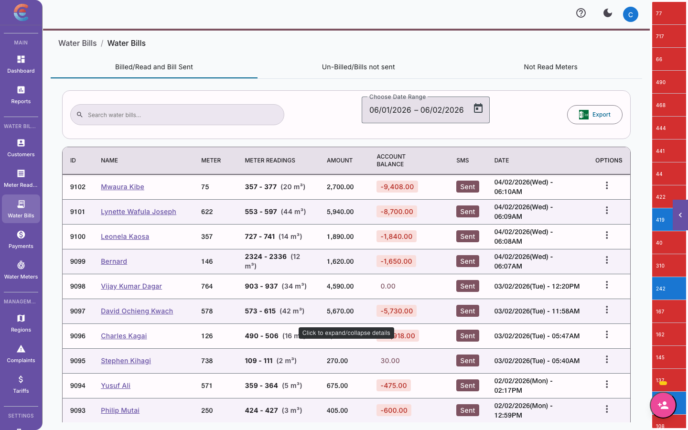
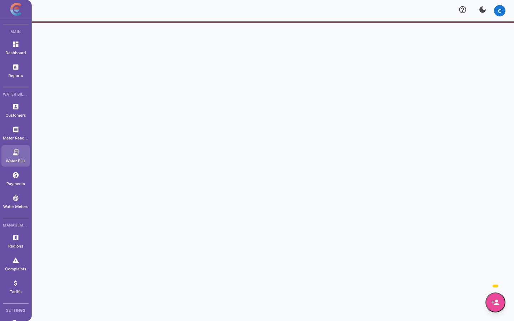
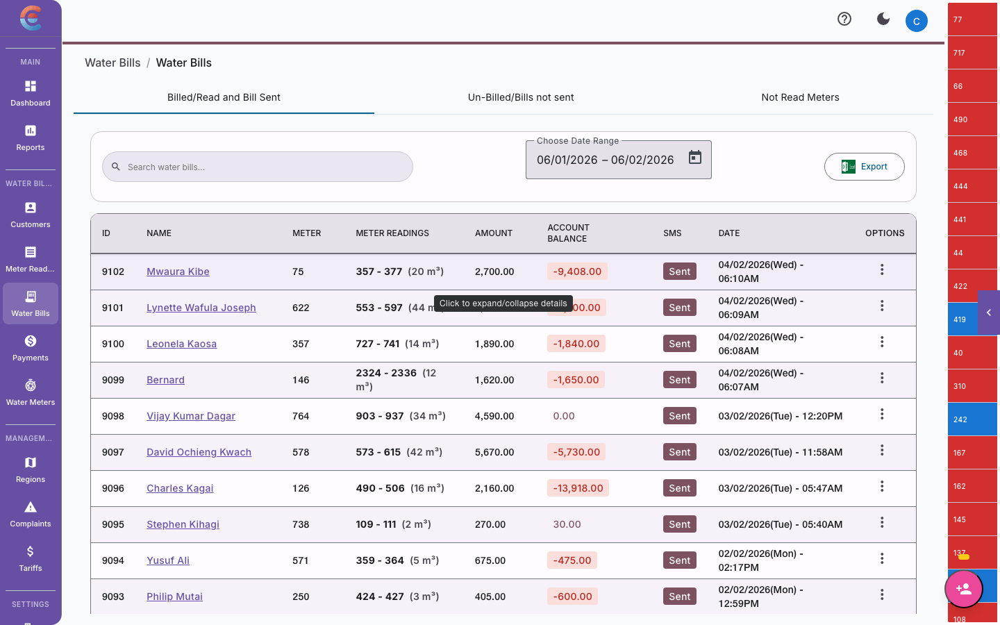

import { Steps, Tabs, TabItem } from '@astrojs/starlight/components';

Billing is where all your setup work comes together. Meter readings become consumption numbers, tariffs turn consumption into charges, service charges and penalties are applied, and the result is a clear, accurate bill for each customer. This guide walks you through the entire billing process — from running a cycle to distributing bills and handling errors.



## How billing cycles work

Billing in EasyBiller follows a predictable rhythm:

```
Reading Period → Bill Generation → Review → Distribution → Payment Collection
```

| Phase | What happens | Timing |
|---|---|---|
| **Reading Period** | Field agents capture meter readings for all active customers | Days 1--7 of the cycle (configurable) |
| **Bill Generation** | System calculates charges based on consumption, tariffs, service charges, and penalties | After readings are complete |
| **Review** | Your team reviews generated bills for accuracy before sending | 1--2 days |
| **Distribution** | Bills are sent to customers via SMS, email, or both | After review approval |
| **Payment Collection** | Customers pay via M-Pesa or cash; payments are reconciled | Until the deadline day |

:::tip
You control when to generate bills — the system does not run billing automatically. This gives you time to ensure all readings are captured and reviewed before bills go out.
:::

## Running a billing cycle



<Steps>

1. Navigate to **Billing** in the main menu.

2. Click **Generate Bills**.

3. Select the **billing period** — the start and end dates for this cycle. The system defaults to your configured billing cycle dates.

4. The system checks for **reading coverage** — how many active customers have readings for this period. You will see a summary like:
   - 450 of 462 customers have readings (97.4%)
   - 12 customers missing readings

5. Decide how to handle **missing readings**:
   - **Skip** — These customers will not receive a bill this cycle. You can bill them in the next cycle or when a reading is captured.
   - **Estimate** — The system generates an estimated bill based on the customer's average consumption over the last 3--6 months.

6. Click **Generate** to start the billing run.

7. The system processes each customer and generates individual bills. This may take a few moments for large customer bases.

8. Once complete, you see a **billing summary** with total bills generated, total revenue, and any issues flagged.

</Steps>

:::caution
Once bills are generated, they exist as records in the system. You can void individual bills if needed, but you cannot "un-generate" an entire billing run. Review the billing period and coverage carefully before clicking Generate.
:::

## Understanding bill calculations

Each customer's bill is calculated using this formula:

```
Bill Total = Water Charges + Service Charges + Penalties - Credits
```

Let us break down each component.

### Water charges (consumption-based)



Water charges are calculated by applying the customer's assigned tariff to their consumption for the period.

**Example calculation:**

A customer consumed 32 units with a three-tier residential tariff:

| Tier | Unit range | Rate (KES) | Units in tier | Charge (KES) |
|---|---|---|---|---|
| Tier 1 | 0--10 | 50.00 | 10 | 500.00 |
| Tier 2 | 11--20 | 75.00 | 10 | 750.00 |
| Tier 3 | 21+ | 100.00 | 12 | 1,200.00 |
| | | | **Total Water** | **2,450.00** |

The system walks through each tier in order, filling up each band before moving to the next one.

### Service charges (fixed)

Service charges are added to every bill regardless of consumption. These are the standing charges, meter rental fees, and other fixed costs you configured in [company setup](/water-billing/company-setup/#service-charges).

| Charge | Amount (KES) |
|---|---|
| Standing charge | 200.00 |
| Meter rental | 100.00 |
| **Total Service Charges** | **300.00** |

### Penalties (late payment)

Penalties are automatically applied to customers who have overdue balances from previous billing cycles. The penalty amount depends on your company's penalty configuration:

| Penalty type | How it works |
|---|---|
| **Percentage-based** | A percentage of the overdue balance is added (e.g., 5% of unpaid amount) |
| **Fixed amount** | A flat fee is added for each overdue invoice (e.g., KES 200 per overdue bill) |

Penalties only apply after the grace period has elapsed. If a customer pays within the deadline plus grace period, no penalty is added.

### Credits (overpayments and adjustments)

If a customer has a credit on their account — from an overpayment, a voided bill, or a manual adjustment — that credit is subtracted from the current bill total.

### Complete bill example


| Line item | Amount (KES) |
|---|---|
| Water charges (32 units) | 2,450.00 |
| Standing charge | 200.00 |
| Meter rental | 100.00 |
| Late payment penalty (5% of KES 1,200 overdue) | 60.00 |
| Credit (overpayment from last month) | -150.00 |
| **Total Due** | **2,660.00** |

## Reviewing bills before sending

Always review generated bills before distributing them. Even with accurate readings and correct tariffs, occasional issues arise.

### The review workflow

<Steps>

1. After generating bills, go to **Billing > Current Cycle**.

2. The system shows all generated bills with summary statistics:
   - Total number of bills
   - Total billed amount
   - Average bill amount
   - Highest and lowest bills

3. **Sort by amount** to identify outliers. Unusually high or low bills deserve a closer look.

4. **Spot-check individual bills** — click on a bill to see the full breakdown (consumption, tier calculations, service charges, penalties, credits).

5. **Check the anomaly-flagged bills**. Bills generated from anomalous readings are marked so you can verify them.

6. If a bill is incorrect, you can **void** it, correct the underlying data (reading or tariff), and regenerate for that customer.

7. Once satisfied, mark the billing run as **reviewed**.

</Steps>

### What to look for during review

| Red flag | Possible cause | Action |
|---|---|---|
| Bill amount is zero | Missing reading or zero consumption | Check if customer is active and reading was captured |
| Bill amount is extremely high | Anomalous reading, wrong tariff | Verify reading and tariff assignment |
| Unexpected penalty | Customer may have paid but payment not recorded | Check payment records before distributing |
| Missing customers | Not included in billing run | Check if reading was captured for this period |

## Distributing bills

Once bills are reviewed and approved, you distribute them to customers.

### Distribution channels

<Tabs>
  <TabItem label="SMS">
    The most common distribution method in East Africa. Each customer receives an SMS with:
    - Billing period
    - Consumption (units)
    - Total amount due
    - Payment deadline
    - Paybill number and account details

    **Example SMS:**
    ```
    NAIROBIWATER Bill for Jan 2025.
    Meter: WM-2024-00451
    Units: 32
    Amount Due: KES 2,660.00
    Due by: 15-Feb-2025
    Pay via M-Pesa Paybill 123456
    Account: ACC-0451
    ```

    :::note
    SMS billing requires that your [SMS provider is configured](/water-billing/company-setup/#sms-notification-setup) in company settings. Each SMS has character limits — the system automatically formats the message to fit.
    :::
  </TabItem>
  <TabItem label="Email">
    For customers with email addresses on file, bills can also be sent as PDF attachments. The email includes a detailed bill with:
    - Full tier breakdown
    - Service charge details
    - Payment history summary
    - Payment instructions

    Email is typically used for commercial customers and institutions.
  </TabItem>
  <TabItem label="Print">
    You can export bills as PDFs for physical printing and hand-delivery. This is useful for:
    - Areas with unreliable mobile networks
    - Customers who do not have phones
    - Formal documentation requirements

    Go to **Billing > Export** and select the region or customer range to print.
  </TabItem>
</Tabs>

### Sending bills

<Steps>

1. Go to **Billing > Current Cycle**.

2. Confirm the billing run is marked as **Reviewed**.

3. Click **Distribute Bills**.

4. Select the distribution channel(s): SMS, Email, or both.

5. Choose whether to distribute to **all customers** or a specific **region**.

6. Click **Send**.

7. The system queues messages and begins sending. You can monitor delivery status in the **Distribution Log**.

</Steps>

:::tip
Send bills at a consistent time each month. Customers learn to expect their bill and are more likely to pay promptly when billing is predictable. Mid-morning (9--11 AM) tends to have the best read rates for SMS.
:::

## Bill history and records

Every bill generated by the system is permanently stored and accessible.

### Viewing bill history

- **For a single customer:** Open the customer record, go to the **Bills** tab. All bills are listed with status (Paid, Unpaid, Partial, Voided).
- **For a billing period:** Go to **Billing > History** and select the period.
- **For the entire system:** Use **Reports > Billing Summary** for aggregate data.

### Bill statuses

| Status | Meaning |
|---|---|
| **Unpaid** | Bill has been generated but no payment received |
| **Partial** | Some payment received, balance remains |
| **Paid** | Full amount has been received |
| **Overdue** | Payment deadline has passed without full payment |
| **Voided** | Bill has been cancelled (does not count toward revenue) |


## Handling billing errors

Mistakes happen — a wrong reading, an incorrect tariff assignment, or a data entry error can produce an inaccurate bill. Here is how to handle them.

### Voiding a bill

Voiding removes a bill from the customer's account. The voided bill remains in the system for audit purposes but no longer counts as an outstanding charge.

<Steps>

1. Open the bill you want to void (from the customer record or billing history).

2. Click **Void Bill**.

3. Enter the **reason for voiding** — this is required for audit compliance.

4. Click **Confirm**.

5. The bill status changes to **Voided** and the amount is removed from the customer's balance.

</Steps>

:::caution
Voiding a bill does not automatically generate a replacement. After voiding, you need to correct the underlying issue (reading, tariff, etc.) and regenerate the bill for that customer.
:::

### Making adjustments

For minor corrections — such as applying a credit for a known issue or adjusting a service charge — you can add a **manual adjustment** to a customer's account without voiding the entire bill.

<Steps>

1. Open the customer record.

2. Go to **Adjustments** or **Account > Manual Adjustment**.

3. Select the adjustment type: **Credit** (reduces balance) or **Debit** (increases balance).

4. Enter the amount and a description explaining the adjustment.

5. Click **Apply**.

</Steps>

The adjustment appears as a separate line item on the customer's account and is reflected in the next bill.

### Regenerating a bill for a single customer

If you voided a bill or corrected a reading and need to issue a new bill for one customer:

<Steps>

1. Go to **Billing > Generate**.

2. Select **Single Customer** instead of the full billing run.

3. Search for and select the customer.

4. Choose the billing period.

5. The system calculates the bill using the current (corrected) data.

6. Review and click **Generate**.

</Steps>

## Pro-rated billing for mid-cycle connections

When a customer connects in the middle of a billing cycle, they should not be charged for the full period. EasyBiller handles this with pro-rated billing.

### How pro-rating works

| Scenario | Billing approach |
|---|---|
| Customer connects on day 1 of the cycle | Full billing — no adjustment needed |
| Customer connects mid-cycle | Pro-rated service charges; water charges based on actual consumption |
| Customer disconnects mid-cycle | Final bill with pro-rated service charges and actual consumption |

For mid-cycle connections:

- **Water charges** are always based on actual consumption (current reading minus initial reading), so these are inherently pro-rated.
- **Service charges** are pro-rated based on the number of days connected divided by the total days in the billing cycle.

**Example:** A customer connects on the 15th of a 28-day billing cycle.

| Item | Calculation | Amount (KES) |
|---|---|---|
| Water charges | 8 units consumed at Tier 1 rate | 400.00 |
| Standing charge (pro-rated) | KES 200 x (14/28) | 100.00 |
| Meter rental (pro-rated) | KES 100 x (14/28) | 50.00 |
| **Total** | | **550.00** |

## Billing checklist

Use this checklist each billing cycle to ensure nothing is missed:

- [ ] All meter readings are captured for the period
- [ ] Anomalous readings have been reviewed and resolved
- [ ] Any new customers have correct tariff assignments
- [ ] Previous cycle's payments have been recorded and reconciled
- [ ] Billing run is generated and summary reviewed
- [ ] Outlier bills have been spot-checked
- [ ] Distribution channel is configured and tested
- [ ] Bills are sent to customers
- [ ] Distribution log confirmed, failed deliveries re-sent

## Next steps

With bills generated and distributed, the next step is collecting payments:

- [Set up and manage payments](/water-billing/payments/)
- [Configure M-Pesa integration](/water-billing/payments/#m-pesa-payment-setup)
- [Handle overdue accounts](/water-billing/payments/#common-payment-issues-and-troubleshooting)
