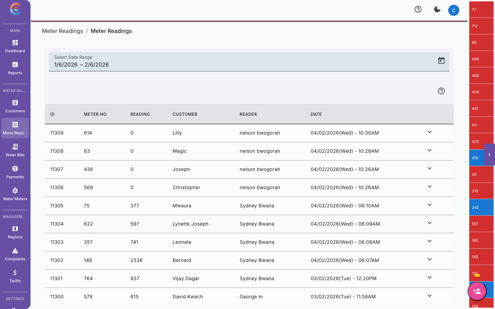
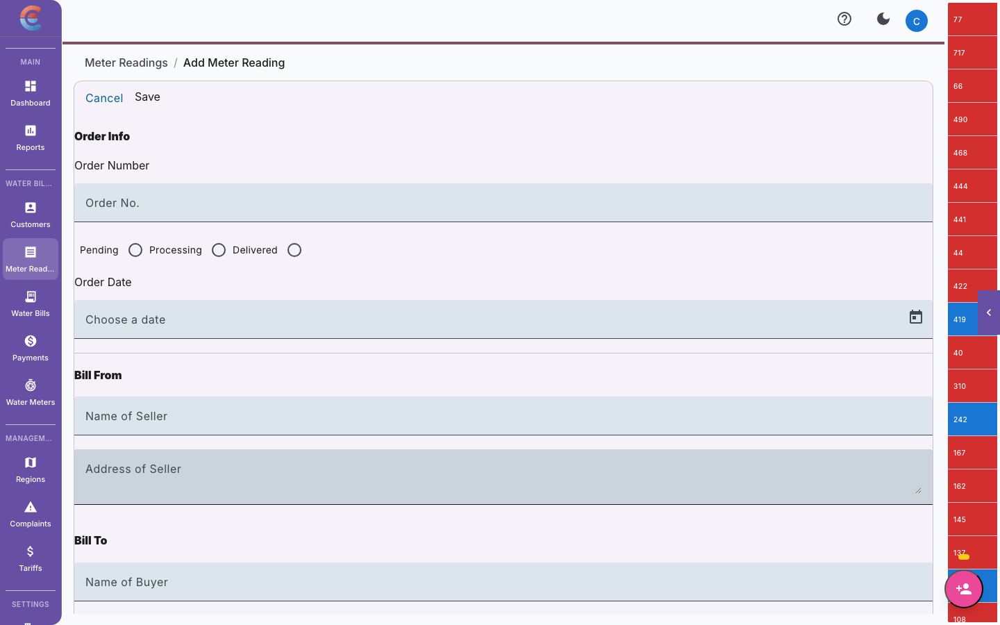

import { Steps, Tabs, TabItem } from '@astrojs/starlight/components';

Meter readings are the raw input that drives your entire billing process. An accurate reading produces an accurate bill. A missed or wrong reading creates disputes, lost revenue, and frustrated customers. This guide covers how to capture readings from the web dashboard, handle anomalies, and connect with field teams using the EasyBill mobile app.

## The reading workflow

Every reading in EasyBiller follows the same basic flow:

1. **Select the customer** whose meter you are reading.
2. **Enter the current reading** from the meter dial.
3. **The system calculates consumption** (current reading minus previous reading).
4. **Submit the reading** for billing.

That is it at its core. The rest of this guide covers the details that make readings accurate and efficient at scale.

## Entering a single reading

<Steps>

1. Navigate to **Readings** in the main menu.

2. Click **New Reading**.

3. **Search for the customer** by name, account number, phone number, or meter serial number.

4. The system displays the customer's **previous reading** and the date it was taken. Verify this looks correct before proceeding.

5. Enter the **current reading** from the meter. Type the exact number shown on the meter dial — do not calculate consumption yourself, the system handles that.

6. The **consumption** field auto-calculates as the difference between the current and previous reading. Review this number for reasonableness.

7. Optionally, upload a **photo** of the meter dial as proof of the reading.

8. Add any **notes** if something was unusual (meter hard to access, customer present, signs of damage).

9. Click **Submit Reading**.

</Steps>

## Understanding the reading form

Here is what each field on the reading form means and why it matters:

| Field | Description | Editable? |
|---|---|---|
| **Customer** | The customer whose meter you are reading | Selected at start |
| **Meter Serial** | The serial number of the assigned meter | Auto-filled, read-only |
| **Previous Reading** | The last recorded reading for this meter | Auto-filled, read-only |
| **Previous Reading Date** | When the last reading was taken | Auto-filled, read-only |
| **Current Reading** | The number currently displayed on the meter | You enter this |
| **Consumption** | Current reading minus previous reading | Auto-calculated |
| **Photo** | Image of the meter dial | Optional |
| **Notes** | Freeform notes about the reading | Optional |
| **Reading Date** | Date the reading was taken (defaults to today) | Editable |

:::tip
If the **reading date** differs from today — for example, if a field agent captured the reading yesterday but is entering it today — change the date to reflect when the reading was actually taken. Accurate dates matter for billing period calculations.
:::

### What the previous reading tells you

Before entering a new reading, glance at the previous reading and its date. Ask yourself:

- **Does the timeframe make sense?** If the previous reading was two months ago instead of one, there may be a missed reading that needs investigation.
- **Is the previous reading plausible?** If it looks suspiciously low or high, the current reading may inherit that error.

## Photo proof capture

Photos of meter dials serve as evidence in case of disputes and help verify readings entered by field agents.

### When to capture photos

| Scenario | Photo recommended? |
|---|---|
| Routine monthly reading | Optional but good practice |
| New customer, first reading | Yes, strongly recommended |
| High consumption anomaly | Yes, required |
| Customer dispute | Yes, required |
| Meter replacement | Yes, for both old and new meters |

### Photo capture tips

- **Get the full dial in frame.** The photo should clearly show all digits on the meter.
- **Ensure readable lighting.** Avoid harsh shadows or glare on the meter face.
- **Include the meter serial number** in the photo if possible — this confirms the right meter was read.
- **Capture the surroundings** if there is evidence of tampering, damage, or access issues.

## Handling anomalies

EasyBiller automatically flags readings that appear unusual based on the customer's historical consumption patterns. This is the **anomaly detection** system.

### What triggers an anomaly flag

| Anomaly type | Description | Common causes |
|---|---|---|
| **High consumption** | Current consumption is significantly above the customer's average | Leak, burst pipe, new tenant, filling a tank |
| **Low consumption** | Current consumption is significantly below the customer's average | Vacant property, bypassed meter, stuck meter |
| **Zero consumption** | No water usage recorded at all | Vacant property, meter fault, disconnected supply |
| **Negative consumption** | Current reading is lower than previous reading | Meter rollover, data entry error, meter replacement not recorded |

### Responding to anomalies

When you submit a reading that triggers an anomaly flag, the system prompts you to:

<Steps>

1. **Review the reading** — Is the number you entered correct? Double-check against the photo or physical meter.

2. **Confirm or override** — If the reading is correct (e.g., a confirmed leak), confirm the anomaly. If it was a typo, correct the reading.

3. **Add an explanation** — Document why the reading is unusual. This note appears in the customer's history and is useful for resolving disputes.

4. **Escalate if needed** — Flag the reading for a supervisor to review before billing proceeds.

</Steps>

:::caution
Never change a correct reading just because it triggered an anomaly flag. The flag is an alert, not an error. If the meter genuinely shows high consumption, record it accurately and investigate the cause separately.
:::

### Common anomaly scenarios and what to do

<Tabs>
  <TabItem label="Suspected Leak">
    **Symptoms:** Consumption is 3x--10x the customer's normal usage.

    **What to do:**
    1. Confirm the reading is correct (take a photo).
    2. Submit the reading and confirm the anomaly.
    3. Notify the customer by SMS about the unusually high consumption.
    4. Recommend they check for leaks — toilets, underground pipes, tank overflows.
    5. Document the notification in the customer's notes.
  </TabItem>
  <TabItem label="Stuck Meter">
    **Symptoms:** Multiple consecutive readings show zero or near-zero consumption for an active connection.

    **What to do:**
    1. Verify the reading is correct by checking the meter physically.
    2. Look for signs the meter dial is not moving when water is flowing.
    3. If confirmed stuck, submit the reading with a note and schedule a meter replacement.
    4. The billing team can apply an estimated bill based on historical average consumption while the meter is replaced.
  </TabItem>
  <TabItem label="Meter Rollover">
    **Symptoms:** Current reading is lower than the previous reading (negative consumption).

    **What to do:**
    1. Verify you are reading the right meter (check serial number).
    2. If the meter has reached its maximum count and rolled over to zero, calculate consumption as: (max value - previous reading) + current reading.
    3. Contact your administrator to handle the rollover adjustment in the system.
  </TabItem>
</Tabs>

## Batch reading entry

When you need to enter many readings at once — for example, after a field team returns from a reading round — batch entry is faster than entering them one by one.

### Using batch entry

<Steps>

1. Go to **Readings > Batch Entry**.

2. Select the **region** to load all active customers in that area.

3. The system displays a table with each customer, their meter serial, and previous reading.

4. Enter the **current reading** for each customer in the table. Consumption auto-calculates as you type.

5. Any anomalies are highlighted in real time — review and confirm or correct as you go.

6. Once all readings are entered, click **Submit All**.

7. The system validates the batch and flags any issues for review before saving.

</Steps>

:::tip
Batch entry works best when your field team records readings in region order. Have agents organize their paper sheets or mobile entries by region before handing them off for data entry.
:::

## Reading history and audit trail

Every reading is permanently recorded in the system. You cannot delete a reading — you can only submit corrections that reference the original.

### Viewing reading history

1. **For a specific customer:** Open the customer record and go to the **Readings** tab. All readings are listed chronologically.
2. **For a region:** Go to **Readings > History** and filter by region and date range.
3. **For anomalies:** Go to **Readings > Anomalies** to see all flagged readings across your system.

### What the audit trail captures

| Data point | Description |
|---|---|
| **Reading value** | The number entered |
| **Submitted by** | The user who entered the reading |
| **Submission date/time** | When the reading was entered into the system |
| **Reading date** | When the reading was physically taken |
| **Photo** | Attached meter photo, if any |
| **Anomaly flag** | Whether the system flagged it, and what type |
| **Notes** | Any comments added by the reader or reviewer |

This audit trail is important for regulatory compliance, dispute resolution, and operational oversight.

## Tips for accurate readings

Accurate readings start in the field. Here are practical guidelines for your team:

### Before the reading round

- **Print or sync your customer list** organized by region and route.
- **Verify meter locations** for new customers before the reading period starts.
- **Charge devices** if using the EasyBill mobile app.

### During readings

- **Read the meter, not the calculator.** Enter the exact number on the dial. Do not do mental math in the field.
- **Clear debris** from the meter face before reading. Dirt, water, or condensation can obscure digits.
- **Record the meter serial number** if you are reading a customer for the first time, to confirm you have the right meter.
- **Take a photo** of any reading that looks unusual.
- **Note access issues** — locked gates, aggressive dogs, overgrown vegetation — so they can be resolved before next month.

### Signs of meter problems

| Sign | Possible issue |
|---|---|
| Meter dial does not move when tap is running | Stuck or jammed meter |
| Meter dial moves when all taps are off | Internal leak downstream of meter |
| Cracked or foggy meter glass | Water ingress, potential damage |
| Broken or missing seal | Possible tampering |
| Meter spinning unusually fast | Leak or burst pipe |

Report any of these signs immediately so the maintenance team can investigate.

## Connection to EasyBill mobile app

For field-based reading capture, EasyBiller integrates with the **EasyBill** mobile app. The app allows field agents to:

- **View assigned customers** organized by reading route
- **Enter readings** on their phone while at the meter
- **Capture photos** directly from the phone camera
- **Work offline** in areas with poor connectivity — readings sync when the agent returns to coverage
- **GPS-stamp readings** to confirm the agent was at the correct location

### How it works

<Steps>

1. **Admin assigns reading routes** in the dashboard by region and field agent.

2. **Field agents open the EasyBill app** on their Android device and see their assigned customers for the current reading period.

3. **At each meter**, the agent enters the reading and takes a photo. The app shows the previous reading and auto-calculates consumption — flagging anomalies in real time.

4. **Readings sync** to the EasyBiller dashboard automatically when the device has connectivity. Offline readings are queued and uploaded when the agent is back online.

5. **Dashboard operators review** synced readings and handle any flagged anomalies.

</Steps>

:::note
The EasyBill mobile app is available for Android devices. Contact your EasyBiller account representative for setup instructions and agent licenses.
:::

## Next steps

With readings captured, you are ready to:

- [Generate bills from your readings](/water-billing/generating-bills/)
- [Review and manage anomalies](/water-billing/meter-readings/#handling-anomalies)
- [Set up payments and M-Pesa](/water-billing/payments/)
